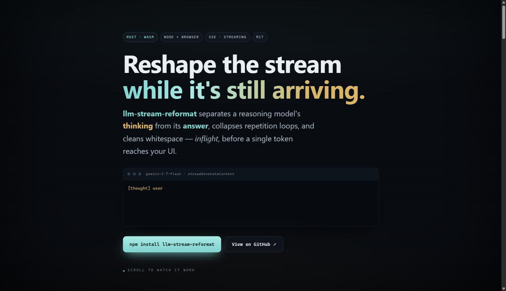

<div align="center">

# 📡 llm-stream-reformat

### Reformat a live LLM token stream — *while it's still arriving*.

Separate a reasoning model's **thinking** from its **answer**, collapse repetition loops, and normalize whitespace, inflight. Parses **Google Vertex** (`gemini-3.7-flash`), **OpenRouter**, and **meta-llm** SSE. Rust + WebAssembly, Node **and** browser.

[](https://www.npmjs.com/package/llm-stream-reformat)
[](./LICENSE)
[](#install)
[](https://github.com/ruvnet/midstream)
[](https://ruvnet.github.io/llm-stream-reformat/)

<br>

<a href="https://ruvnet.github.io/llm-stream-reformat/">
  
</a>

<b><a href="https://ruvnet.github.io/llm-stream-reformat/">▶&nbsp; Open the interactive walkthrough&nbsp;→</a></b>

<sub>An animated, mobile-friendly scroll-through of what happens to the stream.</sub>

</div>

---

> Most "LLM tooling" treats the response as a black box that opens at the end. This treats it as a **stream you can shape per chunk** — the [`ruvnet/midstream`](https://github.com/ruvnet/midstream) philosophy ("pattern-match it, score it, intervene on it — while the tokens are still arriving"). Built on the real `midstreamer-temporal-compare` crate.

## What it does

Reasoning models (like `gemini-3.7-flash`) **interleave a hidden thought stream with the answer**, stutter into repetition loops, and emit messy whitespace. `llm-stream-reformat` fixes that in one streaming pass, before the text ever reaches your UI:

- 🧠 **Separates thinking from answer** — onto distinct channels, so you can show reasoning separately (or hide it).
- 🔁 **Collapses near-duplicate repetition** — using the real midstream `temporal-compare` EditDistance similarity (a common stutter/loop artifact).
- ␣ **Normalizes whitespace** — collapses runs of spaces / blank lines.
- 🔌 **Three providers, one model** — Google Vertex `parts[].thought`, OpenRouter `delta.reasoning`, meta-llm/OpenAI `delta.content`, normalized to a common chunk stream.

Transform-only: it never fabricates content, and it does **not** watermark or strip watermarks (see the sibling project [ai-text-watermark](https://github.com/ruvnet/ai-text-watermark) for provenance marking).

## Install

```bash
npm install llm-stream-reformat        # Node + browser (WASM)
# or, in Rust:
cargo add stream-reformat
```

## Quick start

### Node

```js
const { Reformatter } = require('llm-stream-reformat');

const rf = new Reformatter();
for (const line of sseLines) {              // your provider's raw `data: {...}` lines
  for (const ev of rf.pushSse('google', line)) {
    if (ev.channel === 'thinking') showReasoning(ev.text);
    else appendAnswer(ev.text);
  }
}
rf.finish().forEach(ev => appendAnswer(ev.text));   // flush the last buffered line
```

Each event is `{ channel: 'answer' | 'thinking', text: string }`. Provider is `'google'`, `'openrouter'`, or `'metallm'`.

### Browser / bundlers

```js
import { init, Reformatter } from 'llm-stream-reformat/web';
await init();                               // auto-fetches the wasm
const rf = new Reformatter();
```

### Rust

```rust
use stream_reformat::{Reformatter, Provider, Channel};

let mut rf = Reformatter::new();
for line in sse_lines {
    for ev in rf.push_sse(Provider::Google, &line) {
        match ev.channel { Channel::Thinking => /* … */ (), Channel::Answer => /* … */ () }
    }
}
```

## How it works

```
provider SSE ──▶ normalize ──▶ inflight pipeline ──▶ {answer | thinking} events
 (Vertex /       to a common     • separate thinking
  OpenRouter /    chunk model     • collapse repeats (temporal-compare)
  meta-llm)                       • normalize whitespace
```

Provider adapters parse each dialect's `data:` payload into a neutral `StreamChunk { text, kind }`; the pipeline buffers answer text by line, whitespace-normalizes each completed line, and drops near-exact repeats detected by `midstreamer-temporal-compare`'s EditDistance similarity. Thinking is routed to its own channel. It's O(1) per chunk and streaming — no buffering the whole response.

## Provider wire formats

| Provider | Thinking | Answer |
|---|---|---|
| **Google Vertex** (`:streamGenerateContent`) | `candidates[].content.parts[]` with `"thought": true` | other `parts[].text` |
| **OpenRouter** (`/v1/chat/completions`) | `choices[].delta.reasoning` | `choices[].delta.content` |
| **meta-llm** (OpenAI-compatible) | — | `choices[].delta.content` |

## Design

- [ADR-390 — Inflight LLM-stream reformatting via midstream](./docs/adr/ADR-390-inflight-stream-reformatting-midstream.md)
- [ADR-391 — Autogenous: governed self-evolving architecture](./docs/adr/ADR-391-autogenous-governed-self-evolving-architecture.md) *(the north-star this reformatter is the first observation-layer brick of)*

## Method & prior art

Built on [`ruvnet/midstream`](https://github.com/ruvnet/midstream) — "real-time LLM streaming with inflight analysis" — specifically the published `midstreamer-temporal-compare` crate (DTW/LCS/EditDistance sequence comparison). Note: `@midstream/wasm` is not yet published; this crate compiles the temporal-compare primitive to WASM directly.

## License

MIT © [rUv](https://github.com/ruvnet)

---

<div align="center">
<sub><b>Keywords:</b> LLM streaming · SSE reformat · reasoning model · thinking tokens · gemini-3.7-flash · OpenRouter · meta-llm · midstream · inflight analysis · WASM · Rust · repetition collapse</sub>
</div>
